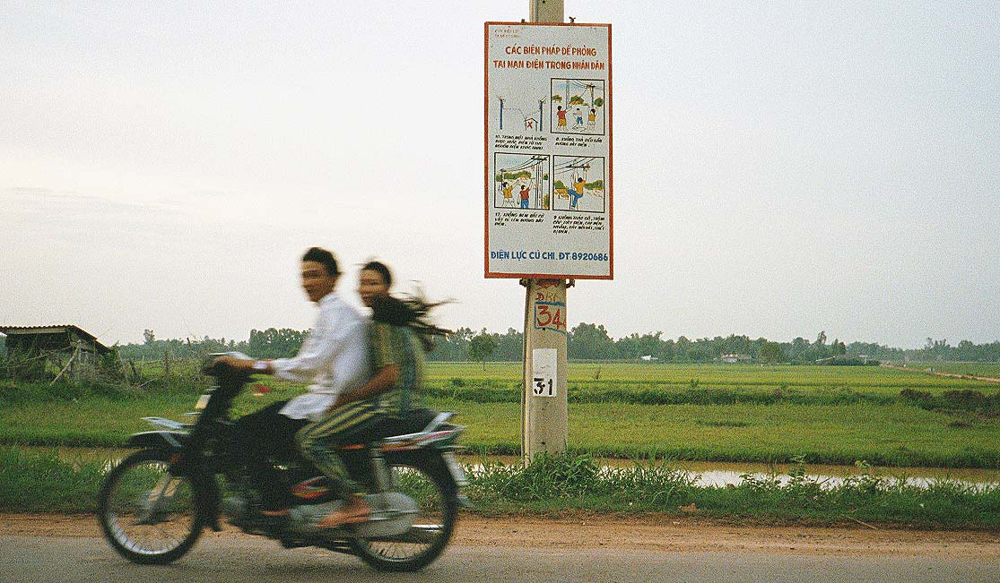
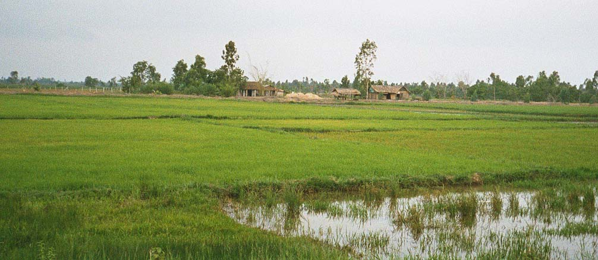

*Travelling overseas* is an ideal instilled in me by my parents who afforded me the opportunity to go on my 8th and 9th grade field trips to Washington DC and Europe. To me, the things I will write about are fairly instinctual; however, for many the idea of preparing and attending such a vast journey into a mysterious land is completely unfathomable. Whether or not you will ever travel away from home as far as Vietnam, I hope you will find some inspiration here to attend to the task of photographing new and wonderful things.

<figure>

<figcaption>
Above Saigon, by Richard E Barber
</figcaption>
</figure>

#	Preparation
*The first order of business* is to prepare. In the year before your trip, you are finalizing and familiarizing yourself with the photography equipment you will bring. Several practice sessions will be required near home during which you will study the operating modes that will produce the photographs you desire, be they daytime landscapes, portraiture, or nighttime street life. All types of photography are needed; people want to see all aspects of the places you visit, and your style and methods will add to the viewers' knowledge of the world both near and far.

<figure>

<figcaption>
Turtle Island MMXXIII, by Richard E Barber
</figcaption>
</figure>

##	Communication
*Vietnam* does not exist in a vacuum; Vietnam is not closed off and the Vietnamese people are not unwelcoming. Nothing instills a feeling of pride and hope more than seeing a foreigner pass through the village. Do not be surprised to see people line up to salute you for choosing to travel to Vietnam. At the same time, do not be surprised to be chased across the sidewalk by vendors and beggars alike. Your presence is economically and socially necessary, and it behooves the traveler to learn at least enough of the language to navigate around the experiences you will encounter.

###	Language lessons
*The first step* in learning the Vietnamese language is by experiencing the Vietnamese culture that is already around you. Google "Banh Mi" to find your local sandwich shop, or "Pho" to find a restaurant specializing in this special beef noodle soup from the North, or "Bun Bo Hue" if you would like to experience a delicious Central Vietnamese beef soup, or "Bun Rieu" if you want to try the South's amazing pounded-crab soup. As you order, attempt to pronounce the menu items and enjoy being corrected on the proper pronunciation and try your hand at imitating the very musical tones of the Vietnamese language.

https://archive.org/embed/fsi-vietnamese-1967

####	Pimsleur method
*I began my study* of Vietnamese in earnest using the 1967 US Department of State Foreign Service Institute's Vietnamese Basic Course, a two-volume manual and cassette tape kit that takes you through imitation, repetition, and dialogue in basic Vietnamese. After a few hours, you will be able to greet your Vietnamese friends in a convincing tone. Very few things will delight a native Vietnamese person more than hearing their language from the mouth of a foreigner. As I mentioned, Vietnamese is tonal. The Latin alphabet used in Vietnam was introduced by European monks whose knowledge of tonal notation extended to the cheironomic (written hand symbols) of Gregorian Chant. It is not enough to learn the written language; rather it is learned and practiced as is a musical song with melodic ups and downs, leaps and dips, and bends and stops. The Basic Course was designed as such: Listening and Repeating. From this course of study grew the professional version known as the Pimsleur Method that inspired our wonderful modern language courses like Rosetta Stone and Duolingo.

<figure>

<figcaption>
Saigon Traffic 2002, by Richard E Barber
</figcaption>
</figure>

##	Travel logistics
*Also* in the year in advance, you are planning your trip. Where will you go? What do you want to see and photograph? Are you a historian? Vietnam will offer you a unique perspective that you may not have previously thought about. Do you love people? Vietnam will astound you with her unabashed beauty. Landscapes? You will be amazed at the tropical variety. Streets? Urban centers will be alive for you day and night. Vietnam is there for you but only if you prepare yourself.

<figure>

<figcaption>
Road Sign XIII, by Richard E Barber
</figcaption>
</figure>

###	Passport
*Step one* is to apply for your passport. Your passport book can take many weeks to produce, so do this as a first step four or five months before purchasing a ticket. 

####  Taking your photo
You are a photographer with a color printer. With a little attention to detail, you can easily generate a higher quality photo than the stand-on-the-line-and-look-forward Polaroid print you can buy at Walgreens for $10. You won't need any filters or processing, just the in-camera jpeg. You won't even need software. US travelers can use a new [official tool](https://tsg.phototool.state.gov/photo) to generate the required dimensioned photo.

<figure>

<figcaption>
Hot Pot, by Richard E Barber
</figcaption>
</figure>

####	Applying for a passport
Your first passport book will be applied for in person. This usually means you must make an advance appointment with your local postmaster to swear on your application and enter the application directly into the federal post. The appointments can sometimes take several weeks to obtain, however, most post offices can oblige with passport applications, so arrange for this early to ensure your convenience. There are significant additional expenses for rush processing so do act on the passport first. All you really need to come up with is an idea of when and where you want to travel (yes, they ask).

<figure>

<figcaption>
Bun Quay, by Richard E Barber
</figcaption>
</figure>

### Getting a visa
A visa to enter Vietnam is an official page pasted into your passport book by the Vietnamese consular authorities. You will be sending your Passport to a local Consulate or Embassy of Vietnam. I have received visa documentation from Vietnamese authorities in both San Francisco and Mexico City. There is an official procedure that can be learned online, however if you use a travel agent this process will be completely taken care of for you. You just need to relinquish your passport. The travel agent will know which agency to send your passport to for the quickest turnaround. 

<figure>

<figcaption>
Mạt chược game set, by Richard E Barber
</figcaption>
</figure>

####	Travel agency
I highly recommend seeking the assistance of a Travel Agent when going to Vietnam. The intricacies of navigating the Vietnamese system could take you years to learn, and travel agents know the ropes. It's not just about getting a flight. Anyone can do that. It's about getting the best flight at the best price and having all your ducks in a row for that 30-second time period you will spend at the immigration desk. The value of professional travel assistance is worth at least twice what you can expect to pay.

<figure>

<figcaption>
Tour Guide in Bến Tre, by Richard E Barber
</figcaption>
</figure>

###	Finding a guide
Once you have an itinerary, you will need a guide. Vietnam is as beautiful as it is scary, so a good guide can be an absolute lifesaver. A guide will have an established in-country network of trust which they can access anywhere at any time. You may not want independence in all your affairs overseas, you want reliability and trust in everything from purchasing snacks to making a real estate transaction.

####	Avoiding scams
Vietnam is developing. Progress is forward and the citizens of Vietnam must work to keep up with a rapidly changing society. There are so many opportunities to get really good deals that it is easy to be taken advantage of. Vietnam is indeed a country of law and order but abidance with law is not universally understood or practiced, unfortunately. Rely on your guide at every step to interact locally- this allows you to relax and come to know the Vietnamese as trustworthy neighbors. Don't be offended or let down if a guide recommends against a particular course of action. Your guide is there to provide you with a diplomatic and fair experience that is beneficial to both the locals and tourists alike.

<figure>

<figcaption>
Rubber Trees III, by Richard E Barber
</figcaption>
</figure>

##	Immunizations
Getting prepared medically is not obvious to everyone. 30 days before your trip you need to contact a Travel Clinic, either through your health care provider, or a local commercial facility. I use my health insurance to access a travel nurse that can prescribe or request prescriptions for inoculations and medicine that you will need when you travel to Vietnam. In the US, our Center for Disease Control maintains a live snapshot of what's going around and where. A travel clinic will be suited to analyze your itinerary and provide you with options that can protect your health the best.

<figure>

<figcaption>
The view atop Cafe 17, by Richard E Barber
</figcaption>
</figure>

###	Urban Vietnam
If you want to stay in urban Vietnam the requirements for immunizations are less than if you travel rurally. 

####	Saigon
One example is Saigon.  Saigon is the urban center of the Ho Chi Minh City province. It is a bustling, active area seemingly far removed from rice paddies and cattle farms. Ho Chi Minh City is a large province that includes several other districts away from Saigon town, and those areas include farms and ranches with a different variety of pests that can be found in the urban center.

<figure>

<figcaption>
River lotus, by Richard E Barber
</figcaption>
</figure>

###	Rural Vietnam
The travel nurse will want to know if you intend to visit a farm or rural area. Unless you are sure you won't be leaving urban Saigon, you can consider your travel to include a visit to a farm, etc. Ho Chi Minh City includes both urban Saigon and vast rubber plantations, endless rice fields soaking in standing water full of breeding mosquitos carrying microbes your system will not recognize.

<figure>

<figcaption>
Water Buffalo Herd, by Richard E Barber
</figcaption>
</figure>
 
####	The outskirts
The urban areas may be too stressful for you. I enjoy brief visits to Saigon, but the traffic and pollution are too much for me to handle. I prefer to stay on the outskirts where highways take you beyond the endless storefronts and houses are separated by empty or still developing plots. Being on the outskirts presents a different set of challenges. Electricity, connectivity, running heated water, etc. are not as reliable as they are in the urban center. Mattresses are not universally used; due to the year-round tropical heat, many prefer to sleep on solid wood beds covered in tatami. You may find yourself going to the bathroom and learning to use a bidet to maintain healthy cleanliness. On the outskirts, you may only find a bucket of water there for you to use. If you are a creature of convenience, you will enjoy the hotels in the urban area. Otherwise, you will learn to adapt to your environment.

<figure>

<figcaption>
Ben Thanh Market MMXVI, by Richard E Barber
</figcaption>
</figure>

> <mark>DISCLAIMER:</mark> The information provided in the following section is for educational purposes only, and does not substitute for professional medical advice. Always consult with your doctor/pharmacist/nurse-practitioner team when dealing with any medical situation you may endure.

##	Your medicine
The travel nurse will ask if you would like to be prescribed a strong anti-diarrheal medication. Do not refuse this prescription, even if you think you have the strongest stomach in the world. The food will be different than what your body is familiar with and it will cause you some discomfort at times. Your luggage must include some over-the-counter remedies to be used if only to allow you to have a slightly more pleasant experience. However at the first sign of fever or severe discomfort, that prescription medicine will absolutely save your life.

<figure>

<figcaption>
Welcome to Hà Tiên, by Richard E Barber
</figcaption>
</figure>

###	Treating your symptoms over-the-counter
As in the United States, doctors, pharmacists, and nurse practitioners alike are authorized by law to write prescriptions for life-saving antibiotic medication. Over there they will know what is available and have the expertise to know which prescription is right for you. However, not all over-the-counter remedies you are used to back home will be available, if at all. Bring them with you because you know they work and you know their side effects.

<figure>

<figcaption>
Cambodian Border, by Richard E Barber
</figcaption>
</figure>

####	Stomach ailments
Generally speaking, the US has different names commercially and generically for most medications. There are a few key remedies that I recommend bringing with you at your and your physician's discretion.
These include:
- Bismuth subsalicylate  (Pepto-Bismol, Kaopectate, pink bismuth stomach relief)
This usually comes as a pink liquid but is also available in tablet and chewable form for people like me who need it but can't handle the liquid's texture.

- Famotidine (Pepcid AC, Famogast, H2 receptor antagonist acid reducer)
In the past, this was prescribed to me for acid reflux and heartburn but is now widely available over the counter. It can be taken in prophylaxis before enjoying a particularly challenging or spicy meal.

- Dimenhydrinate (Dramamine, Gravol, Gastrovol, traveler’s antihistimine)
If you a prone to car or sea sickness, consider taking a tube of Dramamine with you. It can be taken if you are the passenger but may make you too drowsy to drive.

<figure>

<figcaption>
Hà Tiên, the city at the end of the world, by Richard E Barber
</figcaption>
</figure>

####	Headache and joint pain
You may be exposed to painfully long car rides or develop migraines from the sodium content of some foods here. Use an over-the-counter remedy for these moments, as directed.

- Acetaminophen (Tylenol, Paracetamol, Vadol)
This remedy is called Paracetamol in Vietnam and it is molecularly the same as what we call Acetaminophen, or Tylenol. Used as directed.

>> 500mg Rapid Release Capsules
Great for sudden migraine when used as directed.

>> 625 Arthritis Caplets (8-hour pain relief)
If you have back or joint pain, these are stronger but take 30 minutes to work.

<figure>

<figcaption>
Cu Chi Sunrise III, by Richard E Barber
</figcaption>
</figure>

###	Curing your illness by prescription
- ℞ Azithromycin (Zithromax Z-pack, Zmax, TRI-PAC, broad-spectrum macrolide antibiotic)
At home, your doctor is most likely to prescribe a 3 or 5-day course of Azithromycin for severe diarrhea and fever. This is your doctor potentially keeping you out of the hospital- don't refuse it.  You do not want to go to the hospital.

-	℞ Amoxicillin (Penicillin antibiotic)
Younger patients who can not swallow the larger caplets may be prescribed this liquid medication.

- ℞ Cephalexin (Keflex, cephalosporin antibiotic)
If you present to a local doctor or pharmacist in Vietnam with severe fever and diarrhea, you are likely to obtain Keflex.

<figure>

<figcaption>
iPhone shoe, by Richard E Barber
</figcaption>
</figure>

#	Gearing up
As I mentioned in the introduction, you need to be familiar with your gear before you come. Don't buy a whole new kit to learn in Vietnam. You really need to focus more on your surroundings, which will make you a better photographer anyway. Practice your camera. Swap lenses quickly and cleanly. Maintain your power sources.

##	Your camera
I started out in Vietnam in the year 2001 with a 25mm APS film camera.  Now I'm sporting 36 Megapixels.  The satisfaction is the same: capture memories and share them with as many people back home as possible. The memories will last forever.

<figure>

<figcaption>
Panoramic Truckstop, by Richard E Barber
</figcaption>
</figure>

###	Batteries or dual batteries?
On a daily basis, with a single-battery camera, I need to take two batteries and swap them mid-day.  With a dual-battery vertical grip, I can record all day easily. The dual-battery grips are sensitive to voltage differences. If the two batteries are not at the exact same charge level, the camera assumes they are counterfeit and will shut down in order to prevent starting a fire.  When loading the camera with freshly-charged batteries, make sure the camera will function, otherwise, you will need to place each battery back into the charger for a while to ensure they are equal. Therefore it is best to use batteries paired by age. I use a silver Sharpie to mark my battery sets with letter pairs like "A" + "B".

####	Compatibility with cameras
I have found that third-party batteries will work for a certain period, then lose their ability to hold a charge. Like your camera, the batteries should be from the Original Equipment Manufacturer. If you shoot Canon, buy Canon batteries. Don't be fooled into thinking you are saving money by purchasing multiple knockoff cheapos. It's quite the opposite. A pair of good authentic batteries will outlast knock-offs five or six times over.

<figure>

<figcaption>
Tan An Hoi Commune Office, by Richard E Barber
</figcaption>
</figure>

####	Charging your batteries
Charge your batteries completely and daily.  Bring an extra pair in case lightning hits the power line down the road and there's no electricity for a couple of days.

###	Phone camera
Bring your phone camera. They are actually not too bad but you will need to keep the lenses clean with your shirt tails or a microfiber cloth. Your phone may be able to do things your DSLR can not, and it's good to have a variety of tools available while out and about. If your camera goes down or somehow goes missing, you'll be so glad the phone was in your pocket; if your trip is a once-in-a-lifetime, even more so.

<figure>

<figcaption>
Cu Chi Fields, by Richard E Barber
</figcaption>
</figure>

####	Panoramas
Yes, you can stitch really high-resolution panoramas with a set of RAW camera-taken images, but some phone cameras have panoramic capabilities built-in to the software. Practice this phone panorama technique, in case you find yourself in an immersive environment that screams for a long pan.

####	Social Media
Often you will want to record some images on the phone to share socially.  Unless you are not into sharing, I recommend starting up something like a Facebook profile, so you can at least share some of the more striking scenes you are likely to visit.  I also share the camera pics once I've developed them at home with RawTherapee or whatever.

<figure>

<figcaption>
Insulators, by Richard E Barber
</figcaption>
</figure>

##	Choosing lenses
If you have a camera that supports interchangeable lenses I suggest bringing three lenses with you:

###	Ultra-wide angle
When your subject is too close, or you want more environment, you need to use an ultra-wide. There will be times you are standing in front of something you want to photograph, but logistically you can't capture from further away, due to a variety of factors such as roadway traffic, or straying from your group.

<figure>

<figcaption>
Ben Thanh Market, by Richard E Barber
</figcaption>
</figure>

####	10-18mm zoom
My choice for ultra-wide is the inexepensive Canon EFS 10-18mm IS (image stabilization).  It is usable day and night and goes from let's see everything, to a fairly wide angle of 18mm, with only slight distortion. Yes, I would like to be able to afford the 11-22 super lens, but it would be too heavy for me to haul around. The 10-18 costs a tenth of the price and the images are still pleasant and enjoyable. Tools like RawTherapee can assist with curing any distortion issues you encounter.

<figure>

<figcaption>
Cooking Eggs, by Richard E Barber
</figcaption>
</figure>

###	Wide angle
Your wide-angle lens should be light and fun. The less glass the better: fewer dielectric transitions lead to sharper images. Every piece of glass gives you two more transitions, and designs can compensate with various geometries and coatings, but that is just adding weight and money to your rig.

####	24 / 40mm pancakes
For APS-C format I recommend a 24mm pancake lens. It's only about an inch thick and does macro as well as it does nighttime photos.  A similarly wide and short lens for full-frame Canons is the EF 40mm pancake. They are tiny but really a dream to use.

###	Telephoto
To capture close-up detail and candid photography, I have to recommend going to 300mm.  They are longer than usual lenses which may turn a few heads, but the satisfaction can't be beaten.

<figure>

<figcaption>
Ice Cream Dessert, by Richard E Barber
</figcaption>
</figure>

####	28-300mm zoom
I stopped eating cheeseburgers for a few months and spent the money on a red-striped 28-300L with still and panning Image Stabilization. 300mm handheld is not very useful without stabilization or very high ISO with a fast shutter.  With a stabilizer, the image quality will be much better. From a fairly wide 28mm, it has a lot of range, and the quality is nearly reference.

##	Accessing electricity
Outlets in Vietnam accept both the two-pronged and two-bladed types of plugs. Earth ground is not available from the sockets, and I wouldn't count on the fixture being grounded at all either. It is a higher voltage than we use in the US, so when you plug something you will hear and see a pretty snappy little spark. Just do it quickly and you and your equipment will be fine.

###	240V/50Hz compatibility
I don't own anything that won't work both here and there: if you read the fine print on most of your power adapters and chargers, you will see they are nearly all compatible with both 120 and 240 Volts at 50 or 60Hz.  The first time I brought one of those international adapters, but quickly found it completely unnecessary.

<figure>

<figcaption>
Cu Chi Sunset A, by Richard E Barber
</figcaption>
</figure>

##	Data storage
Don't forget to put good memory in the camera. Knockoff memory is notorious for corrupting images. I like brand names like SanDisk, Kingston, and even store brands like Onn are working well for me.  I am super wary of Amazon specials in this regard, and you would be too if your photography journey is running into the thousands of dollars.  Why pinch a penny on what to you is critical infrastructure? It is a risk not worth taking.

###	Extra memory
You can buy a Terabyte card and leave it in for the whole trip. My worry is that if the one card goes bad, I lost the entire trip. Therefore it is better to bring along several 128GB cards.  I have a hard time taking more than 100GB of photos per day, and if one goes down, I still have the other 9.

###	External storage devices
This is one area I have yet to explore. I've been thinking about having some sort of device that you plug an SD card into and save everything to disk. I believe they exist but until I find one in my price range, I just bring a terabyte worth of cards.

<figure>

<figcaption>
Lottery Ticket Hawker, by Richard E Barber
</figcaption>
</figure>

#	Over there
Get ready! Hop aboard your flight and remember to max out your luggage space with gifts of chocolate, tequila, and other specialties of your home to pass out to your generous hosts.

## Politics
*Does not exist here.* Topics that are up for discussion include: the economy, weather, food, and entertainment, but conversing about local or national politics is just not a thing here. Except for US politics; you will be surprised at the love. Last time I was here some Europeans gave me heat for who we elected president which was good for a hearty laugh. *Be a diplomat, not a pundit!*

<figure>

<figcaption>
Cha Phanxisco, by Richard E Barber
</figcaption>
</figure>

## Religion
*Vietnam is diverse.* You are welcome here and your presence is appreciated and respected no matter what you are, if anything. Depending on where you are, do not be shocked to find a Church, Temple, and Mosque coexisting on the same street corner.

##	The internet
Yes, Vietnam is online.  When I first came, you could access the internet on a Pentium and CRT monitor in stinky cafes crowded with video game addicts. Loading mail.yahoo.com took three-and-one-half minutes to a half-hour. Logging in was a whole other ordeal, and then you got to your email. How frustrating that time was. If you are on FiOs at home and your router supports it, set up a Virtual Private Network (VPN) or simply subscribe to a VPN app on your device. That way you will be able to access the same network resources you have at home. Private IPv6 settings may interfere with your VPN settings resulting in service denials, so turn that feature off if possible.

<figure>

<figcaption>
Riverside life, by Richard E Barber
</figcaption>
</figure>

###	Availability of cell network
You will see many more tall cell phone towers than you do at home. You will also see people driving motorcycles with their faces glued to phones. It's a relatively new phenomenon that has taken the country by storm, so be prepared.  SIM cards can be purchased everywhere and are typically purchased for the data plan.  Older phones will require Vietnamese SIM cards to work on the network, however, my iPhone 13 can talk right through to AT&T's international plan.

###	WiFi ubiquity
Most restaurants will have free wifi.  The password is often printed on a small plaque near the cash register, or you can just ask any staff for the "pass wifi".  As I travel, often I will be taking photos in between and at meals, so bouncing here and there from wifi to wifi is definitely a viable solution to buying SIM cards or activating your international data plan.

<figure>

<figcaption>
Chili Peppers, by Richard E Barber
</figcaption>
</figure>

##	Taboo
It's not just about you! This applies to everyone for security reasons: there are really only a couple of things you mustn't attempt photographically that you will need to think about:

o Do not photograph the police

o	Do not photograph inside a department store

<figure>

<figcaption>
Fire Ants, by Richard E Barber
</figcaption>
</figure>

##	Downtime
You want to be on the go the whole time, but in reality, things move at a different pace here. Be patient and polite at all times; use your time wisely.

###	Be prepared
For example, when I have a few hours to spare in between going out, I am working on this article. Writing is a great way to express the feelings and desires you experience in Vietnam. Or, sit down with your camera and cull out the blurry shots. Walk next door and say hello to people- you will be surprised at the hospitality. Go for a walk; get caught in the rain. When the downpour starts, people will just run to the nearest house porch and wait it out with the residents. Study your maps; plan your next excursion.  Photograph some bricks or tiles, anything that looks mildly interesting- this can help break the monotony of downtime.

<figure>

<figcaption>
Gecko, by Richard E Barber
</figcaption>
</figure>

###	Fallback plans
Sometimes we can not control our environment, and a destination may become inexplicably unreachable; bridges close for repairs, and venues can be shuttered without warning. Use your ingenuity and discover things about your surroundings anyway. The more you bring to the table in terms of knowledge about the area, the more flexibility you will have in your travel plans. A patient, polite, and diplomatic overseas traveler will easily turn the worst-case scenario into an adventure worth remembering.  Be that kind of traveler.

##	Touring
One very important thing that my daughter is reminding me of right now is the different bathrooms here. Some places will have a really nice facilities not too different than what you have at home. In other places, there will just be a hole in the ground and a bucket of water. We learn to survive no matter the comfort level. Some of us will want to prepare for these eventualities, especially the further away from western-style accommodations you travel. That means you may want to pack TP, etc.

<figure>

<figcaption>
Pavingstones, by Richard E Barber
</figcaption>
</figure>

###	Destinations and journeys
As a historian, you may be interested to see those things which are considered tourist traps- the places which have been visited and photographed the most may not excite you however. Your guide may not realize that you are not interested in all the war museums. Be sure to communicate early on in the process, otherwise, you will bring back the same memories everyone else does. You really don't need to crawl through the Cu Chi tunnels to feel the terror of the early 1970s; you don't need to pull the trigger on their machine gun or take that same picture of the covered viper pit. Perhaps you would prefer to see truly amazing and photogenic things just a few miles away like the absolutely glorious Buddhist temple complex atop Nui Ba Den or the visually and sonically stunning Cao Dai Temple in Tay Ninh. In short, don't be the cause of your own disappointment. Learn about where you *really* want to photograph. 

<figure>

<figcaption>
A Fish Pond, by Richard E Barber
</figcaption>
</figure>

####	The bus and taxis
Vietnam has Uber now, it's an app called Grab. You can click a button and a non-random person will swing by on a scooter to take you anywhere you want. You can call taxis and get an air-conditioned ride. Public transit buses are not very comfortable in comparison.

####	Driving
It is possible to drive in Vietnam with a temporary permit issued by your local police station. For a motorcycle permit, you will have to do the figure-eight test for them. Is it necessary?  If you are driving around where traffic is complex, you may be more likely to make a mistake and be hailed to pull over, officially. **YOU DO NOT WANT TO BE PULLED OVER.** I recommend not operating any vehicles, or if you do, only operate in the countryside. In the city, there are copious rules about time periods where certain directions of traffic are disallowed on particular motorways, and it confuses even the local professional drivers. If you need to Go-Pro around, do it the right way and get your permit. Otherwise, just go along for the ride.

<figure>

<figcaption>
Family Bike, by Richard E Barber
</figcaption>
</figure>

###	Dealing with precipitation and humidity
There is a rainy season during our US summer, and a dry season during our winter time. It is always hot and humid. As your lens transitions between air-conditioning and the outside environment, the outer element will fog over. This is normal and ok. I carry a lens pen and microfiber cloth to help the lens stay dry while warming up. After a couple of minutes, the water will disappear and you can begin taking pictures. No need to panic, and absolutely no need to put a useless image-degrading UV-1A over your lens.

### Pest control
I recommend a combination of 25% DEET (OFF! Deep Forest) and another insect repellant like Picaridin (OFF! Clean Feel).  32% DEET lotion also works well here.  15% DEET (OFF! Familycare) will not be strong enough for you. Sleep in an insecticidal mosquito net if possible. Remember to reapply repellents before hitting the sack, and pay close attention to your ankles.  I have had to sit in the hospital to get my bug bites drained, so really *don't skip this step*.

<figure>

<figcaption>
Sunset in Cu Chi, by Richard E Barber
</figcaption>
</figure>

###	Taking the photographs
Click click click click click!

<figure>

<figcaption>
Gourami fish, by Richard E Barber
</figcaption>
</figure>

